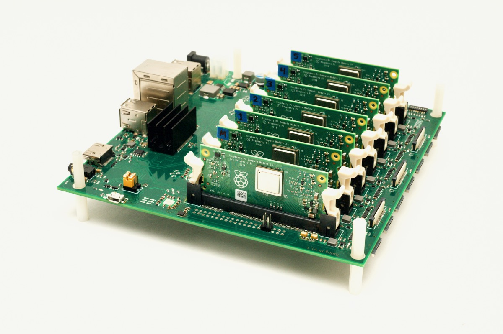

# Turing Pi

Scripts for setting up my Turing Pi V1 cluster. Compute module flashing config adapted from [the official docs](https://docs.turingpi.com).



## Flashing Compute Modules

- Ensure dependencies are installed and download the [Raspberry Pi OS](https://www.raspberrypi.com/software/) image. This only needs to be done once.

  ```bash
  make setup
  make download
  ```

- Switch [the jumper pin on the Turing Pi](https://docs.turingpi.com/get-started/flashing-compute-modules#1.-flashing-node-port-and-flash-mode) into flash mode
- Connect the Turing Pi to your laptop via a micro-USB to USB-C cable
- Insert a compute module into the first slot of the Turing Pi
- Power on the Turing Pi
- Run:

  ```bash
  # Env vars can be omitted; you will be prompted for input if they are missing.
  make flash SSID="My Wifi Network" PSK="my-wpa-password" CMID=1
  ```

- Repeat (incrementing the `$CMID` env var) until all compute modules have been flashed

Once all the compute modules have been flashed:

- Switch the jumper pin back to boot mode
- Insert all the compute modules into their home slots
- Connect the Turing Pi to an ethernet port on your network
- Power on the Turing Pi
- SSH into one of the compute modules

  ```bash
  # Password is "raspberry"
  ssh pi@172.16.1.201
  ssh pi@172.16.1.202
  ssh pi@172.16.1.203
  ssh pi@172.16.1.204
  ssh pi@172.16.1.205
  ssh pi@172.16.1.206
  ssh pi@172.16.1.207
  ```
